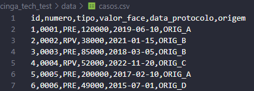

# Cinga Tech Test — Motor de Propostas

Este projeto é um motor de propostas baseado em arquivos, construído para processar dados de propostas com regras de elegibilidade, deságio e arredondamento. O motor lê arquivos CSV, aplica as regras, gera novas propostas elegíveis e salva os resultados em CSV e JSON.

## 🚀 Começando

Este motor de propostas permite processar grandes volumes de dados financeiros diretamente a partir de arquivos, sem necessidade de banco de dados ou serviços externos. As regras implementadas garantem a correta aplicação de descontos (deságio) conforme tipo de origem e senioridade, filtragem por elegibilidade, além de arredondamento padronizado dos valores.


### 📋 Pré-requisitos

- Python 3.10 ou superior instalado (verifique com `python --version` ou `python3 --version`)
- `pip` instalado para gerenciar pacotes (verifique com `pip --version` ou `pip3 --version`)
- Sistema operacional compatível: Windows, Linux ou macOS


### 🔧 Instalação


Clone este repositório:

```bash
git clone https://github.com/seuusuario/seuprojeto.git
cd seuprojeto
```

Instale as dependências:

```bash
pip install -r requirements.txt
```

Prepare os arquivos de entrada na pasta data/ (exemplo: casos.csv).



Ajuste as regras em config/settings.py:

```bash
# config.py

# Regras de elegibilidade
MIN_FACE_VALUE = 50000  # valor_face mínimo para ser elegível

# Deságio base por tipo de caso
BASE_DISCOUNT = {
    "PRE": 0.35,
    "RPV": 0.25,
}

# Data de corte para cálculo de antiguidade (ano-mês-dia)
SENIORITY_CUTOFF_DATE = "2025-01-01"

# Ajuste por ano completo de antiguidade (em pontos percentuais)
YEARLY_ADJUSTMENT_PP = 0.01  # 1 ponto percentual = 0.01

# Ajuste máximo permitido (limite superior de pontos percentuais)
MAX_ADJUSTMENT_PP = 0.10  # máximo de +10 pontos percentuais = 0.10

# Limites mínimo e máximo para o deságio final
MIN_DISCOUNT = 0.10  # mínimo de 10%
MAX_DISCOUNT = 0.60  # máximo de 60%

# Número de casas decimais para arredondar o valor_compra
DECIMAL_PLACES = 2

# Caminhos padrão para arquivos de entrada e saída
INPUT_CSV_PATH = "../data/casos.csv"
OUTPUT_CSV_PATH = "../out/propostas.csv"
METRICS_JSON_PATH = "../out/metrics.json"
LOG_PATH = "../out/run.log"
```

## ⚙️ Executando o projeto

Para processar as propostas, execute:

```bash
python src/main.py
# ou, se necessário:
python3 src/main.py
```
Os arquivos de saída serão gerados na pasta out/:

- "out/propostas.csv" com as propostas elegíveis e valores ajustados

- "out/metrics.json" com métricas do processamento

- "out/run.log" com logs detalhados da execução

## 🔩 Testes principais

- Cálculo da porcentagem ajustada com base nos anos completosVerifica se o ajuste percentual está correto segundo a senioridade até a data de corte.
```bash
test_calculate_seniority_years_correct(protocol_date, cut_date, adjustment_pp, pp_expected)
```
- Validação do deságio final e do valor de compra para os tipos "PRE" e "RPV" conforme definidos
```bash
test_base_discount_and_adjustment(df, config, expected_desagios, expected_valores_compra)
```
- Arredondamento do valor final de compra com duas casas decimais
```bash
test_purchase_value_rounding(df, config, expected_value)
```
- Filtro de elegibilidade para valores mínimos (ex: ≥ 50.000)
```bash
test_filter_eligibility_cutoff(df, config, ellegiblity, not_ellegiblity)
```
- Validação do clamp de deságio para manter valores entre porcentagens limites (ex: 10% e 60%)
```bash
test_calculate_clap_limits(gross_discount, min_discount, max_discount, discount_expected)
```
Para executar os testes:

```bash
python tests/unit_tests.py
# ou, se necessário:
python3 tests/unit_tests.py
```

## 🛠️ Construído com

* [Python 3](https://www.python.org/) - Linguagem principal
* [Pandas](https://pandas.pydata.org/) - Manipulação e processamento de dados

## ✒️ Autores

* **Winicius Silveira** - *Desenvolvimento e documentação* - [winisc](https://github.com/winisc)

## 📄 Licença

Este projeto está licenciado sob a licença **MIT** — consulte o arquivo [LICENSE.md](LICENSE.md) para detalhes.
